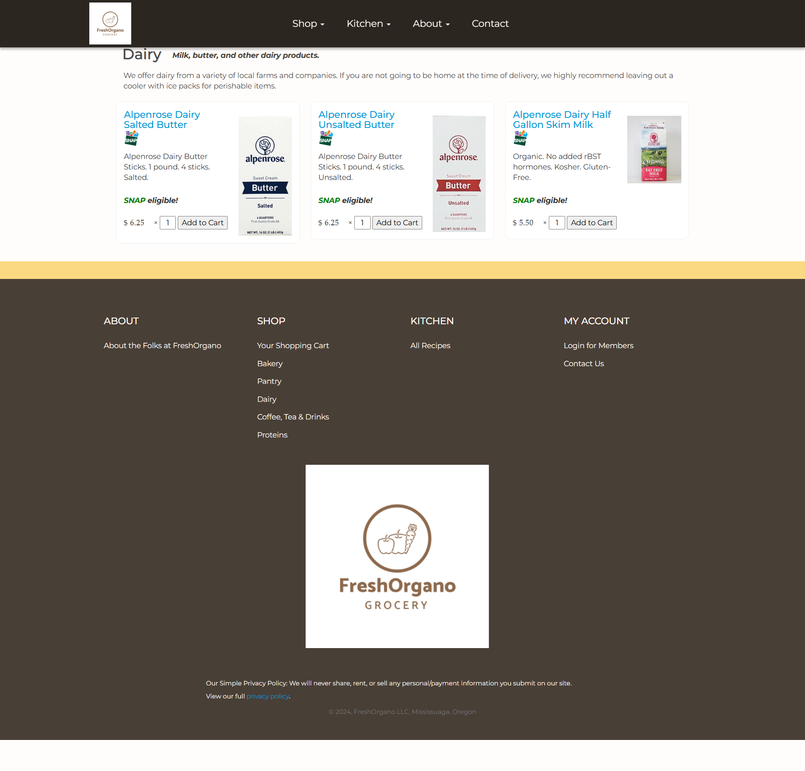

# 🥦 FreshOrgano Grocery – Frontend E-Commerce Website

**FreshOrgano** is a responsive, fully client-side e-commerce website for browsing and purchasing fresh organic grocery products. This project is built using **HTML**, **CSS**, **JavaScript**, and **jQuery** — with a focus on clean UI, usability, and category-based product browsing.

---

## 📸 Project Preview

| Home Page                        | Cart Page                        |
|----------------------------------|----------------------------------|
|    |    |

| Pantry Page                      | Dairy Page                       |
|----------------------------------|----------------------------------|
| |  |

| Recipes Page                     | Contact Us Page                  |
|----------------------------------|----------------------------------|
|  |  |

---

## 🚀 Features

- 🛒 Clean homepage with promotional content and calls to action
- 📦 Product listings under Bakery, Pantry, Dairy categories
- 🧺 Cart system with categorized item sections
- 📋 Organic recipes with full ingredients & instructions
- 📍 Google Maps-based contact page
- 🔀 Responsive design using Bootstrap & custom CSS
- 🧠 jQuery-powered interactions

---

## 🧑‍💻 My Contributions

- Developed and structured all frontend pages (HTML, CSS, JS)
- Implemented dynamic cart layout and sidebar interactions
- Fixed relative linking and folder-based navigation issues
- Styled responsive UI with a professional grocery theme
- Integrated recipe content and Google Maps embedding

---

## 🧰 Tech Stack

- HTML5
- CSS3
- JavaScript (ES6)

---

## 📁 Folder Structure (Simplified)

